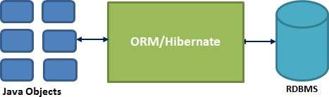

# Introduction to Hibernate

## Learning Objectives

- Understand what an ORM is
- Understand how hibernate works
- Add Hibernate as a dependancy.
- Map a Java class using hibernate
- Perform simple CRUD operations.


## What is an ORM?

`ORM` stands for Object-Relational Mapping and is a programming technique for converting data between relational databases and object oriented programming languages such as Java, C#, etc.

An ORM system has the following advantages over plain JDBC −

- Let’s business code access objects rather than DB tables.
-	Hides details of SQL queries from OO logic.
-	No need to deal with the database implementation.
-	Entities based on business concepts rather than database structure.
-	Fast development of application.

An ORM solution consists of the following four entities −

- An API to perform basic CRUD operations on objects of persistent classes.
-	A language or API to specify queries that refer to classes and properties of classes.
-	A configurable facility for specifying mapping metadata.


## Java ORM Frameworks
There are several persistent frameworks and ORM options in Java. A persistent framework is an ORM service that stores and retrieves objects into a relational database.

- Enterprise JavaBeans Entity Beans
- Java Data Objects
- Castor
- TopLink
- Spring DAO
- Hibernate
- And many more

## Hibernate

Hibernate is an open source persistent framework created by Gavin King in 2001. It is a powerful, high performance Object-Relational Persistence and Query service for any Java application.

Hibernate maps Java classes to database tables and from Java data types to SQL data types and relieves the developer from 95% of common data persistence related programming tasks.

Hibernate sits between traditional Java objects and database server to handle all the works in persisting those objects based on the appropriate O/R mechanisms and patterns.



## Hibernate advantages

- Hibernate takes care of mapping Java classes to database tables using XML files without writing any SQL code.

- Provides simple APIs for storing and retrieving Java objects directly to and from the database.

- If there is change in the database or in any table, then you need to change the XML file properties only.

- Abstracts away the unfamiliar SQL types and provides a way to work around familiar Java Objects.

- Provides simple querying of data.

## First Hibernate app.

> Hand out starter code.

Here we have our basic employee system.

We will start by using hibernate and map the Employee class to our database.  

We are going to be using Hibernate and Postgresql. We also need to add a dependancy called Javassist. Hibernate currently uses Javassist to instrument classes at runtime.

So lets start by adding these as dependencies in our pom.xml

```xml
<!-- pom.xml -->

<dependencies>
   <dependency>
      <groupId>org.hibernate</groupId>
      <artifactId>hibernate-core</artifactId>
      <version>4.3.5.Final</version>
    </dependency>

    <!-- https://mvnrepository.com/artifact/org.postgresql/postgresql -->
    <dependency>
      <groupId>org.postgresql</groupId>
      <artifactId>postgresql</artifactId>
      <version>9.4.1212</version>
    </dependency>

    <dependency>
           <groupId>javassist</groupId>
           <artifactId>javassist</artifactId>
           <version>3.12.1.GA</version>
       </dependency>
</dependencies>
```

Ok so let's start hibernating!

## Hibernate Configuration

The configuration file is the first file you create in any Hibernate application. It is usually created only once during application initialisation.
It represents a configuration object required by Hibernate.

The configuration object provides two keys components −

- Database Connection − This component details the database connection including drivers, host, username and password.

- Class Mapping Setup − This component creates the connection between the Java classes and database tables.

This is handled through a configuration file supported by Hibernate called hibernate.cfg.xml.

Lets create this file.

- Right click resources folder
- Select new > file
- Name the file hibernate.cfg.xml

```xml
<!-- hibernate.cfg.xml -->

<?xml version='1.0' encoding='UTF-8'?>
<!DOCTYPE hibernate-configuration PUBLIC
        "-//Hibernate/Hibernate Configuration DTD 3.0//EN"
        "http://www.hibernate.org/dtd/hibernate-configuration-3.0.dtd">

<hibernate-configuration>

</hibernate-configuration>
```

## Session Factory

We need to set up a session-factory to allow Hibernate to connect to our database.

You need one SessionFactory object per database. If using multiple databases use separate configuration files to create multiple SessionFactory objects.

Properties required here are:

**hibernate.dialect**

- This property makes Hibernate generate the appropriate SQL for the chosen database.

**hibernate.connection.driver_class**

- The JDBC driver class.

**hibernate.connection.url**

- The JDBC URL to the database instance.

#### Optional

**hbm2ddl.auto**

- Tells hibernate what do do with the schema each time a SessionFactory is created.
- Values could be create, create-drop, update, validate

> We will use create-drop to drop and recreate the schema each time as we will be making a lot of changes to tables through the week. 

**hibernate.connection.username**

- The database username.

**hibernate.connection.password**

- The database password.

**hibernate.connection.pool_size**

- Limits the number of connections waiting in the Hibernate database connection pool.

**hibernate.show_sql**

- Allows us to see the SQL happening under the hood at runtime and keep a log of all transactions.

Lets set up the configuration we will need.

```xml
<!-- hibernate.cfg.xml -->

<hibernate-configuration>
    <session-factory>
        <property name="hbm2ddl.auto">create-drop</property>
        <property name="connection.driver_class">org.postgresql.Driver</property>
        <property name="connection.url">jdbc:postgresql://localhost/employeedb</property>
        <property name="hibernate.dialect">org.hibernate.dialect.PostgreSQLDialect</property>
        <property name="connection.pool_size">1</property>
        <property name="show_sql">true</property>
        <mapping resource="employee.hbn.xml"/>
    </session-factory>
</hibernate-configuration>
```

## Persisting our Employee class.

So we are going to take the values from our `Employee` class attributes and persist them to our database in a table.

A `mapping` document helps Hibernate determine how to pull the values from the classes and map them to a table and associated fields.

Java classes whose objects or instances will be stored in database tables are called `persistent` classes in Hibernate.

Hibernate works best if these classes follow some simple rules, also known as the Plain Old Java Object (POJO) programming model.

- All Java classes that will be persisted need a default constructor.

- All classes should contain an `ID` in order to allow easy identification of your objects within Hibernate and the database. This property maps to the primary key column of a database table.

- All attributes that will be persisted should be declared private and have getter and setter methods defined.

Our `Employee` class is set up this way so lets map it to a database table.

## Mapping the class

To map the class we need to create a mapping file.

Mappings are usually defined in an XML document. This mapping file instructs Hibernate how to map the defined class or classes to the database tables.

You should save the mapping document in a file with the format `<classname>.hbn.xml`.

- Create a new xml file in the resources folder called `employee.hbn.xml`.

```xml
<!-- employee.hbn.xml -->
<?xml version='1.0' encoding='UTF-8'?>
<!DOCTYPE hibernate-mapping PUBLIC
        "-//Hibernate/Hibernate Mapping DTD 3.0//EN"
        "http://hibernate.sourceforge.net/hibernate-mapping-3.0.dtd">

<hibernate-mapping>

</hibernate-mapping>
```

The mapping document is an XML document with `<hibernate-mapping>` as the root element, which contains all the `<class>` elements.

```xml
<!-- employee.hbn.xml -->

<hibernate-mapping>
  <class name = "models.Employee" table = "employees">

  </class>
</hibernate-mapping>
```

The `<class>` elements are used to define specific mappings from Java classes to the database tables. The Java class name is specified using the `name` attribute of the class element and the database table name is specified using the `table` attribute.

```xml
<!-- employee.hbn.xml -->

<hibernate-mapping>
  <class name = "models.Employee" table = "employees">
    <id name = "id" type = "int" column = "id">
      <generator class="identity"/>
   </id>
  </class>
</hibernate-mapping>
```
The `<id>` element maps the unique ID attribute in class to the primary key of the database table.
The `name` attribute of the id element refers to the property in the class and the `column` attribute refers to the column in the database table. The `type` attribute holds the hibernate mapping type.

The `<generator>` element within the id element is used to generate the primary key values automatically.
The `class` attribute of the generator element is set to `identity`. This maps to a primary key.

```xml
<!-- employee.hbn.xml -->

<hibernate-mapping>
    <class name = "models.Employee" table = "employees">
        <id name = "id" type = "int" column = "id">
            <generator class="identity"/>
        </id>
        <property name = "firstName" column = "first_name" type = "string"/>
        <property name = "lastName" column = "last_name" type = "string"/>
        <property name = "salary" column = "salary" type = "integer"/>
    </class>
</hibernate-mapping>
```
The `<property>` element is used to map a Java class property to a column in the database table. The `name` attribute of the element refers to the property in the class and the `column` attribute refers to the column in the database table. The `type` attribute holds the hibernate mapping type, these mapping types will convert from Java to an appropriate SQL data type.

Lastly we now need to point to this mapping file in our hibernate configuration.

```xml
<!-- hibernate.cfg.xml -->

<hibernate-configuration>
  <session-factory>
      <!-- as before -->
       <mapping resource="employee.hbn.xml"/> <!-- NEW -->
    </session-factory>
</hibernate-configuration>
```

## Creating a new session.

Well we need to set up a class to handle connecting to the database and to manage the session.

Lets create a new `SessionFactory` and use this to handle our hibernate transactions.

We will do this in the `HibernateUtil` class in the db package.

There are number of methods provided by the Session interface, but we're just going to use .buildSessionFactory().

>You can check Hibernate documentation for a complete list of methods associated with Session and SessionFactory.

- Connection.configure().buildSessionFactory()

Creates the SessionFactory based on our hibernate.cfg.xml.
If an error occurs this method will throw it back up to parent rather than catching it.

```java
// HibernateUtil.java
package db;
import org.hibernate.SessionFactory;
import org.hibernate.cfg.Configuration;

public class HibernateUtil {

    private static final SessionFactory sessionFactory = buildSessionFactory();

    private static SessionFactory buildSessionFactory() {
        try {
            // Create the SessionFactory from hibernate.cfg.xml
            return new Configuration().configure().buildSessionFactory();
        }
        catch (Throwable ex) {
            // Make sure you log the exception, as it might be swallowed
            System.err.println("Initial SessionFactory creation failed." + ex);
            throw new ExceptionInInitializerError(ex);
        }
    }

    public static SessionFactory getSessionFactory() {
        return sessionFactory;
    }
}
```

## CRUD!

Next step is to implement our `CRUD` functions.

Rather than do this within the `Employee` class we will set up a separate class to deal with the CRUD functions for our employee.
Why? Because a) It will keep the `Employee` class clean and simpler without doing any database related tasks and b) It is a recognised pattern to set up a data access object.

A data access object (DAO) is an object that provides an abstract interface to some type of database or other persistence mechanism. By mapping application calls to the persistence layer, the DAO provides some specific data operations without exposing details of the database. This isolation supports the Single responsibility principle.

- Create a new java Class in db package called `DBEmployee`.

Now lets create our CRUD functionality as static methods.

## Create

Lets start by saving the employee to database.


```java
// DBEmployee

package db;

import models.Employee
import org.hibernate.HibernateException;
import org.hibernate.Query;
import org.hibernate.Session;
import org.hibernate.Transaction;

import java.util.List;

public class DBEmployee {

  private static Transaction transaction;
  private static Session session;

     public static void saveEmployee(Employee employee) {

         session = HibernateUtil.getSessionFactory().openSession();
         try {
             transaction = session.beginTransaction();
             session.save(employee);
             transaction.commit();
         } catch (HibernateException e) {
             transaction.rollback();
             e.printStackTrace();
         } finally {
             session.close();
         }
     }

}

```

So now we are able to save our employee to the database without writing a single line of SQL code.

The SessionFactory is able to handle all of the transactions for us with minimal SQL needed.

Also have you noticed that we haven't created an SQL file for tables yet?

We don't have to!

All we need to do is create the database to work with and hibernate will map over the class and create the table for us because we have specified its details in `employee.hbn.xml`.

Whoop!

Lets recreate the `employeedb` we used earlier.

```bash
#terminal
dropdb employeedb
createdb employeedb

```

So now we have `employeedb` without any tables.

We will use the Runner class to seed our database and debug the results.

```java
import db.DBEmployee;
import models.Employee;

public class Runner {

    public static void main(String[] args) {
        Employee employee1 = new Employee("Jack", "Jarvis", 25000);
        DBEmployee.saveEmployee(employee1);
    }
}
```

Now run this file and we should see this output:

```
Hibernate: select nextval ('hibernate_sequence')
Hibernate: insert into employees (first_name, last_name, salary, id) values (?, ?, ?, ?)
```

This means it has worked. We can see the SQL generated by hibernate and the values are encapsulated away so they are never exposed at this layer. If we go to terminal and connect in to `psql` we should see Jack Jarvis in our database

```bash
psql
\c employeedb
SELECT * FROM employees;
```
And there he is!

Whoop!

One last little cool thing hibernate does it also sets the id of our employee object automatically so we can access it from java straight away.

We will tell the debugger to stop at the end of the main method.

To do this we will just add in a breakpoint to the closing } of the main method and start debugging at this point.

> Note we do this because if we stop the debugger on the DBEmployee.saveEmployee(employee1); this line of code will not run.

try it

```java
//Runner.java

public static void main(String[] args) {

Employee employee1 = new Employee("Jack", "Jarvis", 25000);
DBEmployee.saveEmployee(employee1);
} // Debugger breakpoint added here.
```

Now debug the program using the debugger option and lets look at the result.

if you expand the employee1 object you will see that it has an id value associated with it.

Awesome!

##Task

Create a 2nd employee and save to the database.

> If students create duplicate entries at this point drop the database and recreate to clear until we get to deleteAll().

## Read

So lets get the employees back from the database.

With hibernate we can query the database and get all the rows form the employee table. A bonus method that is available is `.list()`. This will bring us back a List of employee objects. So hibernate will query the table and for each row map the entry to a new `Employee` object.

To query we can use HQL (Hibernate Query Language), which is similar to SQL.

HQL has slightly different syntax though so that hibernate can translate the HQL to the appropriate SQL query depending on the database you are using. (More on this later)

```java
// DBEmployee

package db;

import models.Employee;
import org.hibernate.HibernateException;
import org.hibernate.Session;
import org.hibernate.Transaction;

public class DBEmployee {
    private static Transaction transaction;

    // AS BEFORE

    public static List<Employee> getEmployees()
   {
       session = HibernateUtil.getSessionFactory().openSession();
       List<Employee> employees = null;
       try {
           transaction = session.beginTransaction();
           String hql = "from Employee";
           employees = session.createQuery(hql).list();
           transaction.commit();
       } catch (HibernateException e) {
           transaction.rollback();
           e.printStackTrace();
       } finally {
           session.close();
       }
       return employees;
   }
 }
```

So here we have executed a query on the database and specified what table we want to essentially `SELECT *` from.

Note that we use the class name `Employee` rather than the table name `employees` in our query. This is because we are using Hibernate Query Language (rather than SQL).

HQL works with persistent objects and their properties. HQL queries are translated by Hibernate into conventional SQL queries, which in turns perform action on database.

OK... so lets see the employees in debugger.

```java
// Runner.java

public class Runner {

    public static void main(String[] args) {
        DBEmployee.deleteAll();

        Employee employee1 = new Employee("Jack", "Jarvis", 25000);
        DBEmployee.saveEmployee(employee1);

        Employee employee2 = new Employee("Isa", "Drennan", 30000);
        DBEmployee.saveEmployee(employee2);

        List<Employee> employees = DBEmployee.getEmployees();


    } // DEBUGGER
}
```

And if you debug you should see the list of employees.

Now, the more we run this file the more times the same entries will be duplicated so we probably want to delete everything from the table at the start.

## Task

Write a `deleteAll()` method in `DBEmployee` and call this before we create a new employee in the runner.

> Hint you will need to run an HQL query as there is no delete all method in session.

```java
// DBEmployee.java

public static void deleteAll(){
        session = HibernateUtil.getSessionFactory().openSession();
        try {
            transaction = session.beginTransaction();
            String hql = "delete from Employee";
            Query query = session.createQuery(hql);
            query.executeUpdate();
        } catch (HibernateException e){
            transaction.rollback();
            e.printStackTrace();
        } finally {
            session.close();
        }
    }
```

```java
// Runner.java

public static void main(String[] args) {
        DBEmployee.deleteAll(); // NEW

        Employee employee1 = new Employee("Jack", "Jarvis", 25000);
        DBEmployee.saveEmployee(employee1);
      } // DEBUGGER
```

So we create a query string and then create the query in the session and execute.

We can do this with all types of queries but the majority of them have a hibernate method we can call.

##Task

- Map the Department class using hibernate.
- Save a couple of new department instances to the database.
- Delete all departments from database.

## Recap
> Instructor note: Ask the class...

Why use an ORM instead of native SQL?

<details>
<summary>Answer:</summary>

- Let’s business code access objects rather than DB tables.
-	Hides details of SQL queries from OO logic.
-	No need to deal with the database implementation.
-	Entities based on business concepts rather than database structure.
-	Fast development of application.
</details>

<br>

What does the configuration file deal with?

<details>
<summary>Answer:</summary>

- Database Connection
- Class Mapping Setup

</details>
<br>

What does HQL stand for?

<details>
<summary>Answer:</summary>

- Hibernate Query Language

</details>

## Summary

We've seen:
 - What an ORM is.
 - Advantages of Hibernate.
 - Setting up a Hibernate project,
 - Mapping a class to hibernate
 - Saving and deleting to database using HQL.

Hibernate is a really powerful tool when it comes to persisting Object Orientated applications.

Hibernate will also deal with relationships like one-many and many-many, inheritance and mapping collections.
