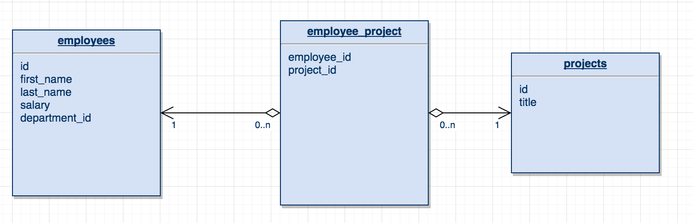

# Many-To-Many Relationships using annotations

## Learning Objectives

- Understand the many-to-many relationship.
- Know how to map many-to-many relationships using hibernate annotations.

## The many-to-many relationship

We are now going to introduce a many-to-many relationship into our employee system.

Let's say that our employees can work on projects. One employee can work on many projects at the same time and each project can have many employees working on them at a time.

A `many-to-many` mapping can be implemented using a `Set` java collection, just like the `one-to-many` mapping.

We already have seen how to map `Set` collection in hibernate, so we are all set to go with `many-to-many` mapping.

Remember we want to use a Set as there should be no duplicate element required in the collection.

When we create the many-to-many relationship we will need a join table to relate the two classes as shown below.



> Hand out start point.

## Many-to-many

Let's add in a new class for `Project`s.

```java
// Project.java

package models;
import javax.persistence.*;

@Entity
@Table(name="projects")
public class Project {

  private int id;
  private String title;

  public Project() {
  }

  public Project(String title) {
    this.title = title;
  }

  @Id
  @GeneratedValue
  @Column(name = "id")
  public int getId() {
    return id;
  }

  public void setId(int id) {
    this.id = id;
  }

  @Column(name = "title")
  public String getTitle() {
    return title;
  }

  public void setTitle(String title) {
    this.title = title;
  }
}
```

And amend the hibernate.cfg.xml file to include this class in the mappings.

```xml
<!-- hibernate.cfg.xml -->

<mapping class = "models.Employee"/>
<mapping class= "models.Department"/>
<mapping class="models.Project" /> <!-- NEW -->
```

So we want to map a `Set` in both `Project` and `Employee` class relating to each other.

Let's start by adding the Set of projects to the `Employee` class.

We will initialise this as an empty set in the constructor so that we can add to it later.

```java
// Employee.java

@Entity
@Table(name="employees")
public class Employee {

  private int id;
  private String title;
  private Set<Project> projects; // NEW

  public Employee() {
  }

  public Employee(String firstName, String lastName, int salary, Department department) {
    this.firstName = firstName;
    this.lastName = lastName;
    this.salary = salary;
    this.department = department;
    this.projects = new HashSet<Project>();
  }

  // AS BEFORE

  public Set<Project> getProjects() {
    return projects;
  }

  public void setProjects(Set<Project> projects) {
    this.projects = projects;
  }
}
```

Ok so now we need to add the annotations to map the project to employees. Again we will add the annotations to the getter so that hibernate uses this to access the property.

```java
// Employee.java

  @ManyToMany(cascade = CascadeType.All) // NEW
  @JoinTable(name = "employee_project") // NEW
    public Set<Project> getProjects() {
      return projects;
  }
```

Ok so first we declare the relationship type. We then declare the name of the join table we will need.

Next we will have to give information about the join columns to be included in the join table. So these will be `employee_id` and `project_id`. This needs to go within the brackets after `cascade = CascadeType.All`. The join columns are detailed within a set of `{}`
We declare the join column for this class using `@JoinColumn` annotation and the column relating to the Project class as `inverseJoinColumns`

```java
// Employee.java

@ManyToMany(cascade = CascadeType.ALL)
@JoinTable(name = "employee_project",
joinColumns = {@JoinColumn(name = "employee_id", nullable = false, updatable = false)},
inverseJoinColumns = {@JoinColumn(name = "project_id", nullable = false, updatable = false)}) // NEW

```

We don't want these columns to be null or to be updated.

Next we add the set of employees to `Project` and annotate it to be mapped by the `projects` property of `Employee`.

Again in the constructor we will initialise this to be empty.

```java
// Project.java

@Entity
@Table(name="projects")
public class Project {

  private int id;
  private String title;
  private Set<Employee> employees; // NEW

  public Project() {
  }

  public Project(String title) {
    this.title = title;
    this.employees = = new HashSet<Employee>(); //NEW
  }

  //AS BEFORE

  @ManyToMany(fetch = FetchType.EAGER, mappedBy = "projects") // NEW
  public Set<Employee> getEmployees() {
    return employees;
  }

  public void setEmployees(Set<Employee> employees) {
    this.employees = employees;
  } // NEW
}
```

Ok so we should have these mapped OK so let's try this out.

First of all drop and recreate the database

```bash
dropdb employeedb
createdb employeedb
```


```java
// Runner.java

public static void main(String[] args) {

  // AS BEFORE

  Project project1 = new Project("Employee System");
  Helper.save(project1); // NEW
} // DEBUGGER HERE
```

Debug the file and our project should be saved and our join table should have been created.

In terminal run `psql`:

```bash

psql
user=# \c employeedb

employeedb=# SELECT * FROM projects;

employeedb=#SELECT * FROM employee_project;
```


Nice. So now all that remains is adding employees to projects.

Let's create an `addProject()` in `Employee`

```java
// Employee.java

public void addProject(Project project){
  this.projects.add(project);
} // NEW
```

And an `addEmployee()` method in `Project`

```java
// Project.java

public void addEmployee(Employee employee){
  this.employees.add(employee);
} //  NEW
```

Next we will create a method in DBHelper to call these and pass in the appropriate objects.

> Note: Create this outside of the main method.

```java

  public static void addEmployeeToProject(Employee employee, Project project){
    employee.addProject(project);
    project.addEmployee(employee);
    DBHelper.update(project);
    DBHelper.update(employee);
  } // NEW
}
```
And finally we will call this method from inside main and pass in the employee and project.

Let's add both employees to the same project.

```java
// Runner.java

public class Runner {

  public static void main(String[] args) {
    // AS BEFORE

    DBHelper.addEmployeeToProject(employee1, project1);
    DBHelper.addEmployeeToProject(employee2, project1);
  }
}
```

So lets see if this has worked!

In psql terminal

```bash
# terminal

employeedb=# SELECT * FROM employee_project;
```

Bosh! our employees and project have been linked together.

## Getting a list of employees.

Let's check that we can get a list of employees back from the project.

All we should need to do here is find the project and call it's `getEmployees()` method.

```java
// Runner.java

Project project = DBHelper.find(Project.class, project1.getId());
       Set<Employee> employees = project.getEmployees(); // NEW

```

And there they are.

## Recap
> Instructor note: Ask the class...

When mapping many-to-many what does `@JoinTable` do?

<details>
<summary>Answer:</summary>
- Generates a table in the database to link two tables with a many-to-many relationship.
</details>

<br>

And in many-to-one what does `@JoinColumn` do?

<details>
<summary>Answer:</summary>

Creates the column in the join table referencing the primary key of the entity.

</details>
<br>

## Summary

We've seen:
 - What a many-to-many relationship is
 - How to map many-to-many-relationships in hibernate using annotations
 - How to return a `Set` from entity.
