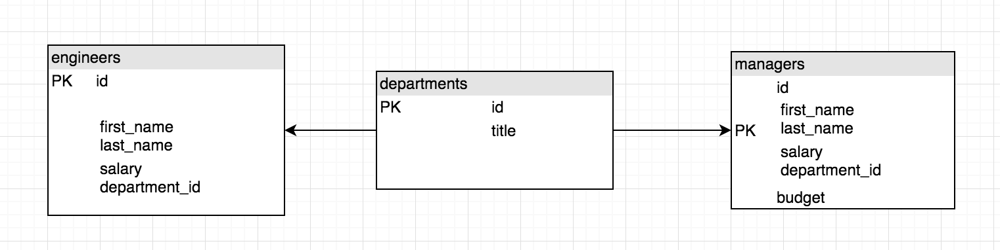
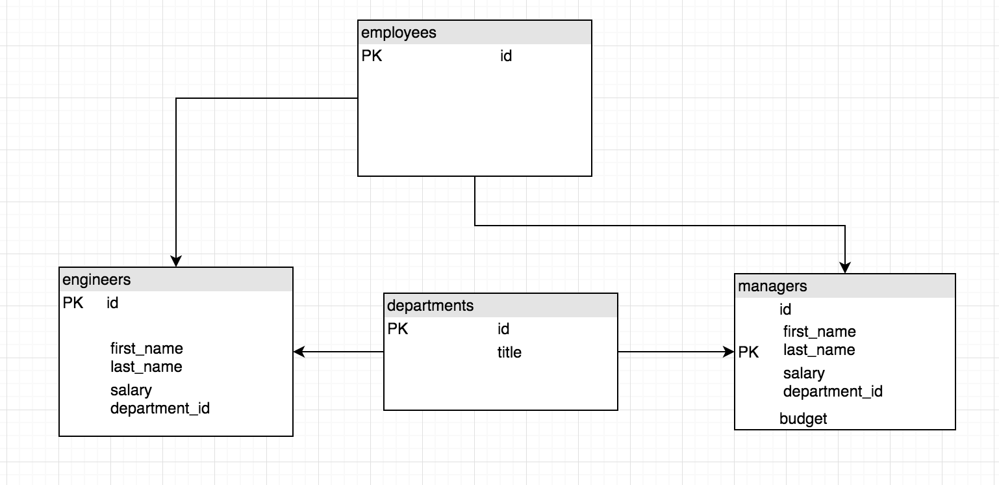
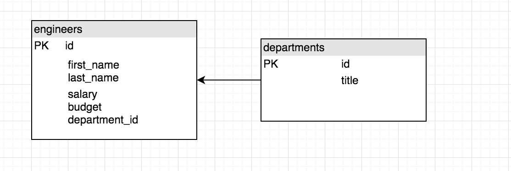
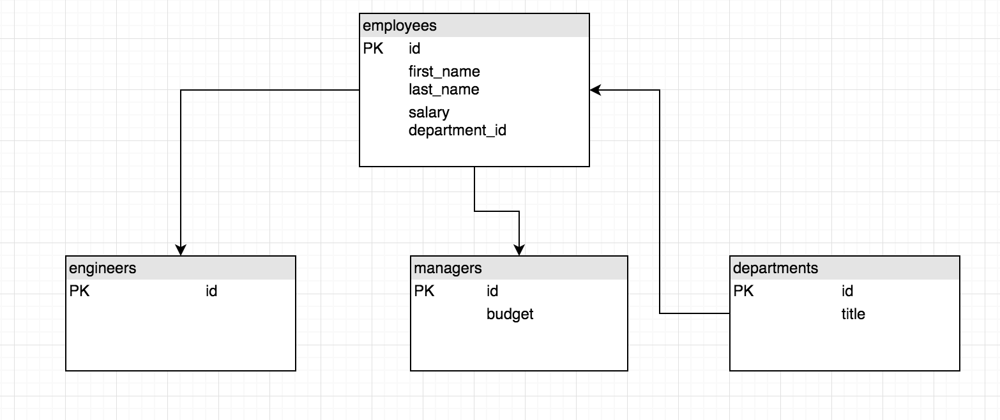

# Inheritance with Hibernate

## Learning Objectives

- Understand the 4 ways to implement inheritance with hibernate.
- Know how to map abstract classes.
- Know how to map inheritance chains using the joined strategy

## Inheritance with Hibernate

As we have seen inheritance is one of the key concepts in Java.

That often becomes an issue, if you try to map these models to a relational database. SQL doesn’t support this kind of relationship and Hibernate, or any other JPA implementation has to map it to a supported concept.

You can choose between 4 strategies which map the inheritance structure of your models to different table structures.

Each of these strategies has its advantages and disadvantages. It’s, therefore, important to understand the different concepts and to choose the one that is most suitable to your application.

> Hand out start point and have students open

Here we have the Employee system similar to the one we created in week 1 with managers and developers inheriting from an abstract employee class.

So how can we map this properly to a database using hibernate?


## Inheritance strategies

JPA and Hibernate support 4 inheritance strategies which map the domain objects to different table structures.

#### Mapped Superclass

The mapped superclass strategy is the simplest approach to mapping an inheritance structure to database tables. It maps each concrete class to its own table.



That allows you to share the attribute definition between multiple entities. But it also has a huge drawback. A mapped superclass is not an entity, and there is no table for it.

To implement this strategy we would add in `@MappedSuperclass` to the top of our class instead of declaring it as an entity.

```java
@MappedSuperclass
public abstract class Employee{
}
```

Manager and Engineer would then be mapped in the usual way using `@Entity` and `@Table`.


#### Table per Class

The table per class strategy is similar to the mapped superclass strategy.

The main difference is that the superclass is now also an entity.
Each of the concrete classes gets still mapped to its own database table.

This mapping allows you to use polymorphic queries and to define relationships to the superclass.

But the table structure adds a lot of complexity to polymorphic queries, and you should, therefore, avoid them.



To implement this we would declare an `Inheritance Strategy` to the top of our `Employee` class.

```java
@Entity
@Inheritance(strategy = InheritanceType.TABLE_PER_CLASS)
public abstract class Employee {
}
```
#### Single Table

The single table strategy maps all entities of the inheritance structure to the same database table. This approach makes polymorphic queries very efficient and provides the best performance.



But it also has some drawbacks. The attributes of all entities are mapped to the same database table. Each record uses only a subset of the available columns and sets the rest of them to null. (So for example all engineers would have a null budget entry in their row.)

You can, therefore, not use not null constraints on any column that isn’t mapped to all entities. That can create data integrity issues, and your database administrator might not be too happy about it.

To implement this we would again include an `Inheritance Strategy` but also a `discriminator` column to distinguish between managers and engineers. This entry would just be a `String`.

```java
@Entity
@Inheritance(strategy = InheritanceType.SINGLE_TABLE)
@DiscriminatorColumn(name = "Employee_Type")
public abstract class Employee {
}
```

#### Joined

The joined table approach maps each class of the inheritance hierarchy to its own database table.

This sounds similar to the table per class strategy. But this time the abstract superclass `Employee` also gets mapped to a database table.

This table contains columns for all shared entity attributes. The tables of the subclasses are much smaller than in the table per class strategy.

They hold only the columns specific for the mapped class and a primary key with the same value as the record in the table of the superclass.



Each query of a subclass requires a join of the 2 tables to select the columns of all entity attributes.

That increases the complexity of each query, but it also allows you to use not null constraints on subclass attributes and to ensure data integrity.

The definition of the superclass `Employee` is similar to the previous examples. The only difference is a value of the inheritance strategy which is `InheritanceType.JOINED`.

This is the strategy that we will focus on as it is easy to use `polymorphic queries` (which we will get to shortly.)

Let's add our inheritance type to the `Employee` class.

```java
// Employee.java

@Entity
@Inheritance(strategy = InheritanceType.JOINED) // NEW
public abstract class Employee {
}

```

The rest of the `Employee` properties are mapped the same way they always have been.

Now in `Manager` and `Engineer` classes we map the classes to tables and any additional properties from these classes as columns.

```java
// Manager.java

@Entity // NEW
@Table(name="managers") // NEW
public class Manager extends Employee {

  // AS BEFORE

  @Column(name="budget") // NEW
  public double getBudget() {
    return budget;
  }

  public void setBudget(double budget) {
    this.budget = budget;
  }
}

```

```java
// Engineer.java

@Entity // NEW
@Table(name="engineers") // NEW
public class Engineer extends Employee {


    public Engineer() {
    }

    public Engineer(String firstName, String lastName, int salary, Department department) {
        super(firstName, lastName, salary, department);
    }

}
```

So let's save some new instances of `Manager` and `Employee` and have a look at our database to see what has happened.

```java
// Runner.java

Department department = new Department("Hr");
DBHelper.save(department);
Manager manager = new Manager("Peter", "Griffin", 40000,department, 100000 );
DBHelper.save(manager);
Engineer engineer1 = new Engineer("Lois", "Griffin", 29000, department);
DBHelper.save(engineer1);
Engineer engineer2 = new Engineer("Stewie", "Griffin", 27000, department);
DBHelper.save(engineer2);

System.out.println(); // Debugger line.
```

So now if we run our debug tool we can see each instance of department, manager and engineers.

You will see that each `manager` and `engineer` has an `ID` associated with it as well.

Now jump to terminal and we will have a look at the tables in psql.

```bash
# terminal

psql
\c employeedb
\dt
```

You will see that we have 4 tables. `employee`, `departments`, `managers` and `engineers`.

Let's look at the `engineer` and `manager` tables first.

```bash
#terminal

SELECT * FROM engineers;
SELECT * FROM managers;
```

So all that is in our engineers table is an id?
And all that is in the managers table is an id and budget?
Then where did the rest of the data go?

Have a look at `employee` table... (note that the table here is singular because we didn't specify a table name in the class.)

```bash
#terminal

SELECT * FROM employee;
```

Ah there's our data.

You will notice that the `ID` of the `employee` table will match the `ID` of the `subclass`.
So `ID` for `Peter Griffin` in `employee` table will match the `ID` in the `managers` table.

This is how the data is linked together.
Each `ID` in `employee` table will relate to the `ID` of either a `manager` or `engineer` (depending on which one was saved).

Let's write a method to return a list of objects from the database. We will use generics in here as it will help us later on.

```Java
// DBHelper.java

public static <T> List<T> getAll(Class classType){
        session = HibernateUtil.getSessionFactory().openSession();
        List<T> results = null;
        Criteria criteria = session.createCriteria(classType);
        results = getList(criteria);
        return results;
    }
```

And let's get a list of Employee objects back

```java
// Runner.java

  List<Employee> employees  = DBHelper.getAll(Employee.class);
```

Cool so we get a list of all the employees back including data from all 3 tables. (For example the manager also has a budget).

This is known as a `polymorphic query`. Any query on the Employee table will bring back either a manager or engineer details or a mixture of the both.

Hibernate queries may name any Java class or interface in the from clause. The query will return instances of all persistent classes that extend that class or implement the interface.

We can get more specific objects back by querying from the `managers` or `engineers` table. This will bring back the relevant data from the `employee` table as well.

Let's try this out...

```java
// Runner.java
List<Engineer> engineers = DBHelper.getAll(Engineer.class);
List<Manager> managers = DBHelper.getAll(Manager.class);
List<Department> departments = DBHelper.getAll(Department.class);

```

So you will see that when we call the `getAll()` on a `Manager` or `Engineer` it will bring back the relevant data from the `Employee` class as well.

Sweet!

#### Task

Find a manager and an engineer.


```java
// Runner.java

Engineer foundEngineer = DBHelper.find(Engineer.class, engineer1.getId());

Manager foundManager = DBHelper.find(Manager.class, manager.getId());
```

Run the debugger and we should now be able to see all details for the manager and engineer.

Awesome!

#### Task

- Write a method in `DBHelper` that takes in a department id and returns the manager for that department.

#### Solution

```java
// DBHelper.java

public static Manager findManager(Department department){
       session = HibernateUtil.getSessionFactory().openSession();
       Manager result = null;
       Criteria criteria = session.createCriteria(Manager.class);
       criteria.add(Restrictions.eq("department", department));
       result = getUnique(criteria);
       return result;
   }
```

```java
// Runner.java
Manager departmentManager = DBHelper.findManagerForDept(department);
```

## Recap
> Instructor note: Ask the class...

What are the 4 options for mapping inheritance in Hibernate?

<details>
<summary>Answer:</summary>
- Mapper Superclass
- Single Table
- Table per class
- Joined strategy

</details>

<br>

How are managers and engineers linked to their data in the employee table?

<details>
<summary>Answer:</summary>

The manager/engineer table has an id that will match the relevant entry in the employee table.

</details>
<br>

## Summary

We've seen:
 - The 4 strategies for mapping inheritance in Hibernate.
 - How to map inheritance using the joined strategy
 - How to perform polymorphic queries.
